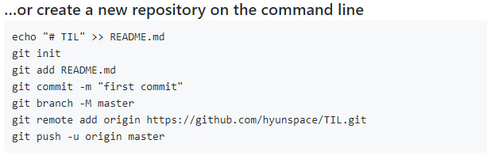

# Github

## 회원가입

### 설정 변경

* main 브랜치를 master 브랜치로 기본값 수정


## 원격 저장소와 로컬 저장소 연결

### Repository(원격 저장소) 생성

* git remote
* git push


### github 사이트 설정

* create repository

  * README : 사용 설명서

  

```bash
$ git remote add origin ~
# 원격 저장소 추가할게 / 이름은 origin / 뒤의 주소를
$ git push -u origin master
# 밀어넣을게 / origin 경로에 / master가 작업한 내용을
# 엔터치면 깃헙 로그인 창이 뜸
```


#### staging Area(.git) / N times

* `git remote` : remote 별명 확인
* `git remote -v` : remote 주소 확인
* `git add .` : `.` = all
* `git add file_name.type` : 특정 파일만 올려
* `git status` : `add` 잘 됐는지 확인
* `git commit -m 'commit message'` 
* `git log --oneline`
* `git push`
* `git config --global core.autocrlftrue` : LF 어쩌고 나오면
  * warning: LF will be replaced by CRLF in README.md.
    The file will have its original line endings in your working directory


#### pull/clone

* `git clone <git url>`
* `git pull origin master`
* 


### gitignore

* git에서 관리하지 않는 파일을 만들어 보자

  ```bash
  $ touch .gitignore
  ```

* `gitignore.io` 사이트에서 파일 만들기

  * 파일은 `.git  ` 폴더가 있는 최 상단 폴더 안에

* **프로젝트를 시작할 때**, 가장 처음에 만들어서 git에게 tracking 되지 않게 하자


1. 원격 저장소와 로컬 저장소 모두 존재 + 이미 트래킹 중인 파일을 로컬에서만 더 이상 추적하지 않도록 설정

   ```bash
   $ git update-index --assume-unchaged {file name}
   # 자주 안 씀
   ```

   

2. 로컬에 있는 파일 변동 추적 멈춤

* 원격 저장소에 이미 해당 파일이 있다면, push 할 때 그 파일을 삭제

  ```bash
  $ git rm --cached {file name}
  ```

  * 파일 변동 추적만 중지. 파일이 로컬에서 삭제 되는 것은 아님.
  * 이후 push 해야 원격 저장소에서 파일이 삭제되는 것


3. 로컬과 원격 저장소 모두 파일 삭제 후 추적 중지

   ```bash
   $ git rm {file name}
   ```


### clone

```bash
$ git clone (가져 오려는 A의 github url)
# 현재 내 로컬에 A가 없을 떄
```

