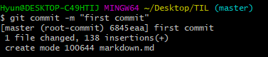
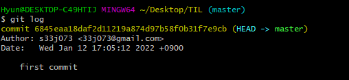
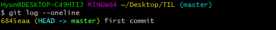

# GIT


1. Git을 이용한 버전 관리 = 분산 버전 관리 프로그램

* 버전: 컴퓨터 소프트웨어의 특정 상태
* 관리 : 어떤

* 버전 관리 : 컴퓨터 소프트웨어의 특정 상태들을 관리하는 것???


2. Github를 이용한 포트폴리오
3. 

---


## 초기 설정

* 최초 한 번만 설정

1. 누가 커밋을 남겼는지 확인할 수 있도록 이름과 이메일을 설정

   ```bash
   $ (주체) (할 일) (범위)
   $ git config --global user.name 이름
   $ git config --global user.email 이메일
   ```

   - `-` 축약, `--` 

2. 설정된 내용 확인

   ```bash
   $ git config --global --list
   # or
   $ git config --global -1
   ```

3. 폴더 내 파일을 git에 초기화

   ```bash
   $ git init
   ```

   

## git init

* 현재 작업 중인 directory git으로 관리

#### 주의사항

* 이미 master로 관리 중인 폴더 내에서 **절대 절대 절대 git init 금지**


## git status

* Working directory와 Staging Area에 있는 파일들의 현재 상태를 확인
* 상태

 	1. `untracked` : git이 관리하지 않는 파일
 	2. `tracked` : git이 관리하는 파일
     1) `Unmodified` : 최신 상태
     2) `Modified` : 수정되었지만 staging area에 반영되기 전
     3) `staged` : Staging area에 반영된 상태


## git add

```bash
# 특정 파일
$ git add file_name.txt

# 특정 폴더
$ git add folder/

# 현재 디렉토리에 속한 모든 파일/폴더
$ git add .
```


## git commit

* staging area에 올라온 파일의 변경 사항을 하나의 버전으로 저장하는 명령어

* `커밋 메세지` 는 현재 변경 사항을 기록하는 용도로 사용

  * 의미 있게 사용하는 것이 좋음
  * `-m` : message

  ```bash
  $ git commit -m "커밋 메시지"
  ```

  

​		`(root-commit)` : 첫 커밋에만 표시

​		`6845eaa` : 중복X 해당 버전의 고유 값

​		`1 file changed, ~ ` : 변경 사항


## git log

* 커밋 내역을 조회할 수 있는 명령어



* 옵션
  * `--oneline` : 한 줄로 축약해서 보여줌
  * `--graph` : 브랜치(branch)와 머지(merge) 내역을 그래프로 보여주는 명령어
  * `--all` : 모든 브랜치의 내역
  * `--reverse` : 커밋 내역의 순서를 반대로 보여주는 명령어
  * 


